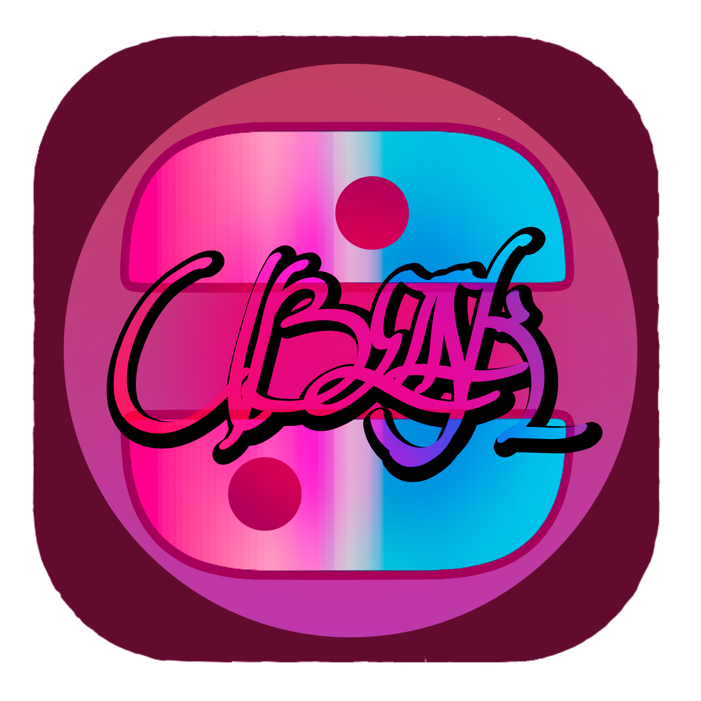
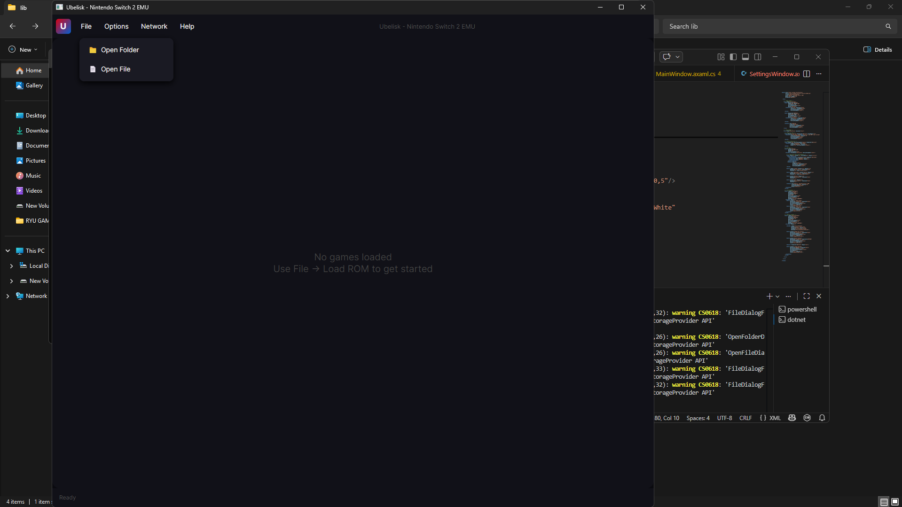

# Ubelisk-Switch-2-Emulator

<p align="center">
  
</p>

<h1 align="center">Ubelisk</h1>
<p align="center">Nintendo Switch 2 Emulator — Early Development</p>

---

<p align="center">
  
</p>

## What is Ubelisk?

Ubelisk is a Nintendo Switch 2 emulator currently in early development. The goal of the project is to eventually achieve full emulation of the Nintendo Switch 2 hardware, starting from a proof-of-concept foundation and building up over time.

This project is being built from the ground up in C# with a focus on accuracy, performance, and a clean user experience.

## Current State

Ubelisk is in very early stages. Here is what is currently implemented:

- ARM64 CPU interpreter with basic instruction support
- 64MB memory map
- Fetch, decode and execute cycle
- SDL2 rendering backend
- Avalonia-based UI with animated boot screen
- File menu with Open File and Open Folder support
- Options menu with fullscreen toggle, profile support and restart
- Full settings window with Interface, GPU, CPU and Emulator tabs
- Red and blue Nintendo-inspired theme throughout

---

## Roadmap

- [ ] Expand ARM64 instruction set coverage
- [ ] GPU emulation and shader support
- [ ] Game library management
- [ ] Controller input support
- [ ] Audio emulation
- [ ] Save state support
- [ ] JIT recompiler for performance
- [ ] Full game compatibility

---

## Building from Source

**Requirements:**
- Windows 10 or later
- .NET 10 SDK
- SDL2.dll (place in project folder)

**Steps:**
1. Clone the repository
2. Place SDL2.dll in the UbeliskUI project folder
3. Open the folder in VS Code
4. Run the following command:
```
dotnet run
```

## Disclaimer

Ubelisk is an independent project and is not affiliated with, endorsed by, or connected to Nintendo in any way. This project does not include and will never distribute any proprietary Nintendo software, firmware, or game files.
